<html>
<h1>Ethan Knox | Physics & Mathematics Graduate</h1>

<h2 style="text-align:center">Career & Research Interests Exploration: A Network Graph Approach</h2>

<h5 style="text-align:center"> - Inspiration & Initial Diagrams by C.R. Nave at Georgia State University - </h5>

<body>
 

<table style="width:100%">
<tr>
    <th></th>
    <th style="text-align:center">Original</th>
    <th style="text-align:center">Mermaid</th>
    <th style="text-align:center">Sage</th></tr>
<tr>
    <th style="text-align:center">Physics</th>
    <td><a href="http://hyperphysics.phy-astr.gsu.edu/hbase/index.html">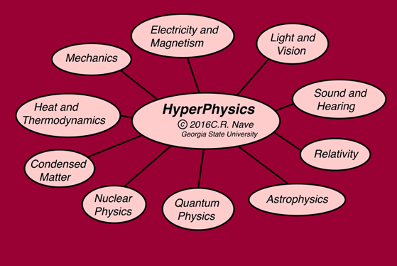</a></td>
    <td></td>
    <td></td>
</tr>
<tr>
    <th style="text-align:center">Electromagnetism</th>
    <td><a href="http://hyperphysics.phy-astr.gsu.edu/hbase/emcon.html">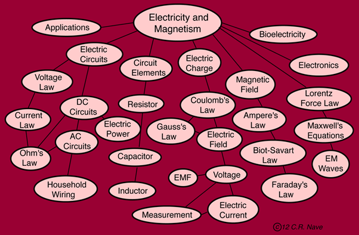</a></td>
    <td></td>
    <td></td>
</tr>
<tr>
    <th style="text-align:center">Optics</th>
    <td><a href="http://hyperphysics.phy-astr.gsu.edu/hbase/ligcon.html">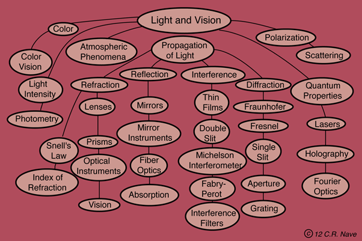</a></td>
    <td></td>
    <td></td>
</tr>
<tr>
    <th style="text-align:center">Acoustics</th>
    <td><a href="http://hyperphysics.phy-astr.gsu.edu/hbase/sound/soucon.html">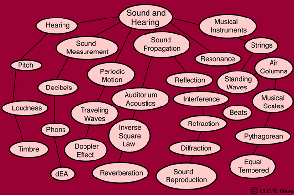</a></td>
    <td></td>
    <td></td>
</tr>
<tr>
    <th style="text-align:center">Relativity</th>
    <td></td>
    <td></td>
    <td></td>
</tr>
<tr>
    <th style="text-align:center">Astrophysics</th>
    <td><a href="http://hyperphysics.phy-astr.gsu.edu/hbase/astro/astcon.html">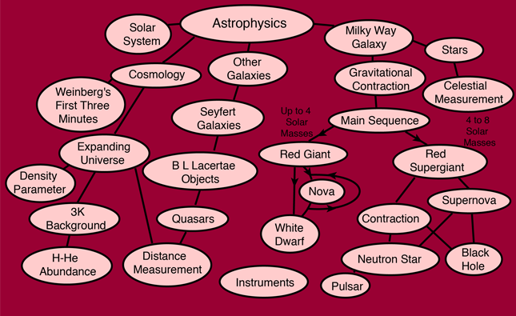</a></td>
    <td></td>
    <td></td>
</tr>
<tr>
    <th style="text-align:center">Quantum</th>
    <td></td>
    <td></td>
    <td></td>
</tr>
<tr>
    <th style="text-align:center">Nuclear</th>
    <td><a href="http://hyperphysics.phy-astr.gsu.edu/hbase/nuccon.html">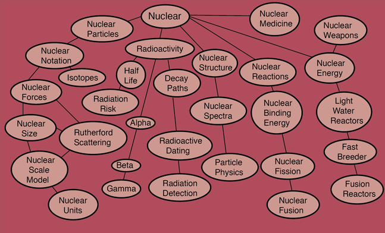</a></td>
    <td></td>
    <td></td>
</tr>
<tr>
    <th style="text-align:center">Condensed Matter</th>
    <td><a href="http://hyperphysics.phy-astr.gsu.edu/hbase/solcon.html">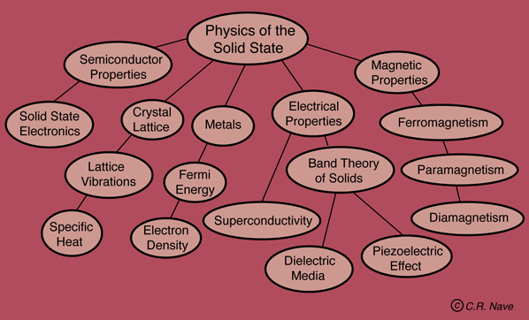</a></td>
    <td></td>
    <td></td>
</tr>
<tr>
    <th style="text-align:center">Thermodynamics</th>
    <td><a href="http://hyperphysics.phy-astr.gsu.edu/hbase/heacon.html">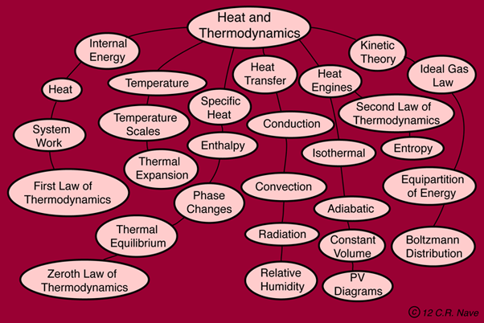</a></td>
    <td></td>
    <td></td>
</tr>
<tr>
    <th style="text-align:center">Mechanics</th>
    <td><a href="http://hyperphysics.phy-astr.gsu.edu/hbase/index.html#mechcon">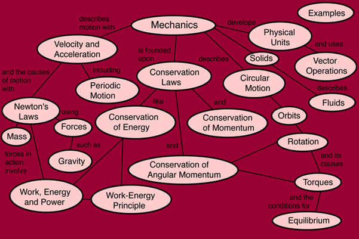</a></td>
    <td></td>
    <td></td>
</tr>
</table>

 

<table style="width:100%">
<tr>
    <th></th>
    <th style="text-align:center">Original</th>
    <th style="text-align:center">Mermaid</th>
    <th style="text-align:center">Sage</th></tr>
<tr>
    <th style="text-align:center">Math</th><td><a href="http://hyperphysics.phy-astr.gsu.edu/hbase/hmat.html">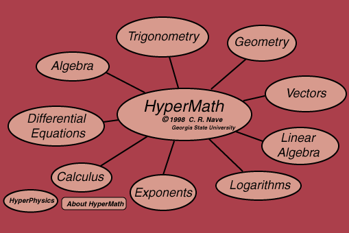</a></td>
    <td></td>
    <td></td>
</tr>
<tr>
    <th style="text-align:center">Trigonometry</th>
    <td>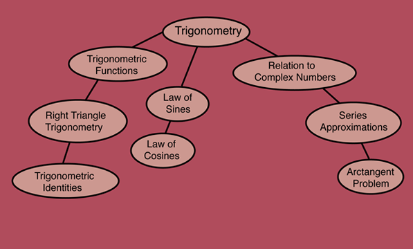</td>
    <td></td>
    <td></td>
</tr>
<tr>
    <th style="text-align:center">Geometry</th>
    <td>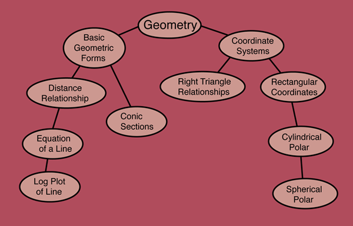</td>
    <td></td>
    <td></td>
</tr>
<tr>
    <th style="text-align:center">Vectors</th>
    <td>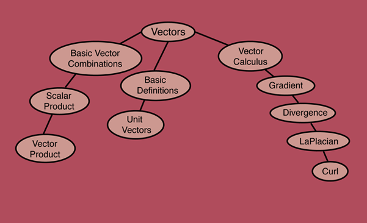</td>
    <td></td>
    <td></td>
</tr>
<tr>
    <th style="text-align:center">Linear Algebra</th>
    <td>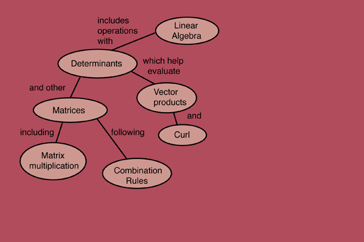</td>
    <td></td>
    <td></td>
</tr>
<tr>
    <th style="text-align:center">Logarithms</th>
    <td>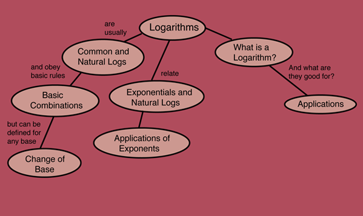</td>
    <td></td>
    <td></td>
</tr>
<tr>
    <th style="text-align:center">Exponents</th>
    <td>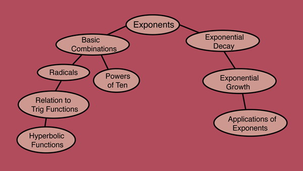</td>
    <td></td>
    <td></td>
</tr>
<tr>
    <th style="text-align:center">Calculus</th>
    <td>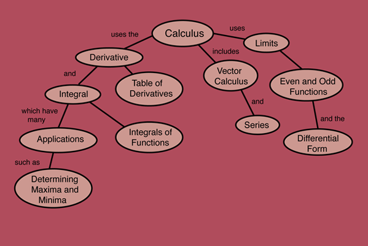</td>
    <td></td>
    <td></td>
</tr>
<tr>
    <th style="text-align:center">Differential Equations</th>
    <td></td>
    <td></td>
    <td></td>
</tr>
<tr>
    <th style="text-align:center">Algebra</th>
    <td>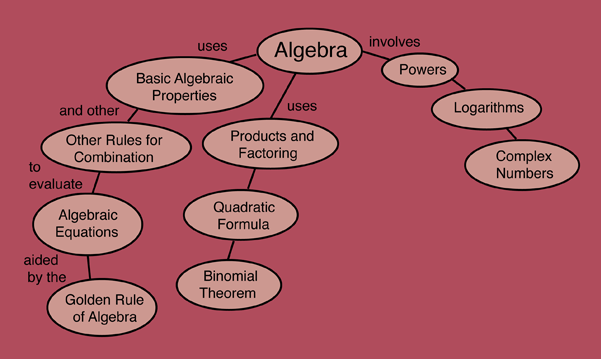</td>
    <td></td>
    <td></td>
</tr>
</table>
</body>
</html>